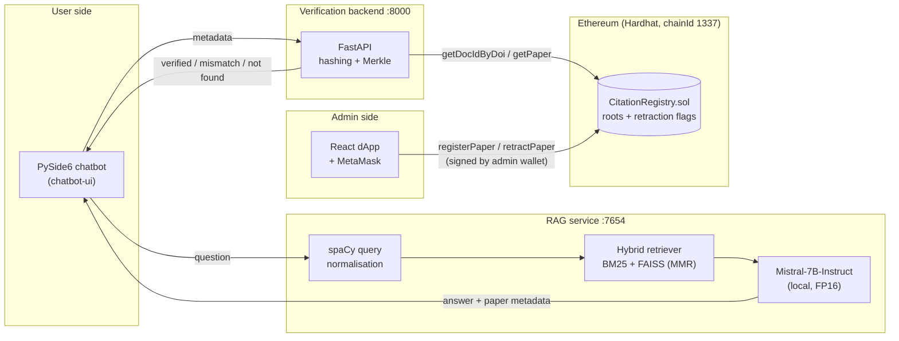

# CiVi — Blockchain-Anchored Citation Verification for LLM Answers

> A local RAG chatbot that answers research questions from a paper corpus, **and then checks the paper it cites against Merkle roots stored on an Ethereum smart contract**, so users can tell a real, unaltered and non-retracted citation from a hallucinated or tampered one.

Built as the group project for **COMP842 (Blockchain)** in the Master's programme at Auckland University of Technology.


---

## The problem

LLMs are good at producing citations that *look* real: a plausible title, a believable author list, a DOI in the right format. Even with retrieval-augmented generation (RAG), the metadata that reaches the user may be wrong, mixed up between papers, or point to work that has since been retracted. Users have no cheap way to check it.

## The approach

CiVi splits the problem into two parts:

1. **Grounded generation.** A locally hosted LLM answers only from retrieved sources, cites exactly one paper, and returns that paper's structured metadata along with the answer.
2. **Trustless verification.** A registrar (e.g. a library or publisher) commits each paper's metadata to an Ethereum smart contract as a **Merkle root**. When the chatbot cites a paper, its metadata is re-hashed and compared with the on-chain root. If any field differs (a wrong author, a changed date, a fake DOI), the roots will not match. The contract also records retractions.

Only 32-byte hashes go on-chain, so the paper data stays off-chain while any change to it can still be detected.

---

## Architecture



### How a query flows

1. The user asks a question in the desktop chatbot.
2. **Query understanding:** spaCy strips conversational filler ("find me papers about…") and keeps lemmatised noun chunks.
3. **Hybrid retrieval:** a LangChain `EnsembleRetriever` combines **BM25** (sparse keyword match, weight 0.4) with **FAISS** dense search over `bge-small-en-v1.5` embeddings using **MMR** for diversity (weight 0.6).
4. **Grounded generation:** one source is sampled from the top hits with exponentially decaying weights, and Mistral-7B writes a one-paragraph answer using *only* that source.
5. **Self-check:** if the answer does not name the source paper's title, the service re-prompts once with a stricter instruction. If it still fails, it returns `INSUFFICIENT_EVIDENCE` instead of an unsupported answer.
6. **On-chain verification:** the chatbot sends the cited metadata to the backend, which recomputes the Merkle root, looks up the paper on-chain by DOI (or by title + authors + date), and compares roots and retraction status. The result is shown as a verified / invalid badge next to the citation.

---

## Key technical details

### Merkle commitment scheme

Each paper is represented on-chain by four `bytes32` values:

| Field | Construction | Purpose |
|---|---|---|
| `hashedDoi` | hash of the normalised DOI | Primary lookup key; blocks duplicate registrations |
| `hashedTAD` | `SHA-256(canonicalJSON({title, author[], date}))` | Fallback lookup for papers without a DOI |
| `metadataRoot` | Merkle root over 6 leaves: `doi, title, author, date, journal, abstract` | Detects tampering with any metadata field |
| `fullTextRoot` | Merkle root over fixed-size UTF-8 chunks of the full text | Optional full-text integrity check |

- **Canonical encoding:** each leaf is `canonicalJSON({field: value})` with sorted keys, no whitespace and UTF-8 encoding, so every client produces the same bytes for the same metadata.
- **Domain separation:** leaves are hashed as `SHA-256(0x00 ‖ data)` and internal nodes as `SHA-256(0x01 ‖ left ‖ right)`. Without this, an attacker could present an internal node as a leaf (a second-preimage attack), a known weakness of simple Merkle trees.
- **Normalisation:** Unicode NFKC normalisation and stripping of DOI prefixes (`https://doi.org/`, `doi:`), so formatting differences do not cause false mismatches.

### Smart contract: [`CitationRegistry.sol`](blockchain/contracts/CitationRegistry.sol)

- Role-based access control through OpenZeppelin `AccessControl`: `DEFAULT_ADMIN_ROLE` grants and revokes `REGISTRAR_ROLE`, and only registrars can register or retract papers.
- Each DOI or title-author-date hash can be registered only once. A retracted record stays on-chain and cannot be registered again, which keeps a full audit trail.
- **Editing is append-only:** changing a paper retracts the old record and registers a new one, so history is never overwritten.
- Emits `PaperRegistered` and `PaperRetracted` events for off-chain indexing.

### Verification backend: [`backend/`](backend/)

FastAPI + web3.py service that:
- recomputes hashes and Merkle roots from submitted metadata,
- authenticates admin requests by recovering the signer from an **EIP-191** signature and checking `hasRole(REGISTRAR_ROLE, signer)` on-chain,
- exposes `/register`, `/retraction/set`, `/retraction/status`, `/papers/edit`, `/validate/complete-metadata` and `/paper/status`.

### Admin dApp: [`src/`](src/)

React 19 + ethers v6 web interface with MetaMask. Registrars can **create**, **alter** (retract + re-register) and **retract** citations, and every state change is signed by the admin's own wallet.

### RAG service: [`rag_query/`](rag_query/)

- Corpus: 49 recent arXiv papers across neural networks, semiconductors, supervised learning, blockchain and language models, fetched with the arXiv API.
- A custom LangChain `BaseLanguageModel` wrapper runs a local Hugging Face causal LM (`device_map="auto"`, FP16), so no data leaves the machine.
- Includes a `/debug/retrieve` endpoint for inspecting retrieval results.

### One-command local environment: [`scripts/start_services.py`](scripts/start_services.py)

Checks dependencies, starts a Hardhat node, deploys the contract, grants roles, starts the backend, **registers the whole paper corpus on-chain**, and starts the React dev server. It streams timestamped logs from every child process and shuts everything down cleanly on `Ctrl+C`.

---

## Tech stack

| Layer | Technologies |
|---|---|
| LLM / NLP | Mistral-7B-Instruct, Hugging Face Transformers, PyTorch, LangChain, spaCy |
| Retrieval | FAISS, BM25, `BAAI/bge-small-en-v1.5` embeddings, MMR |
| Blockchain | Solidity 0.8.27, OpenZeppelin AccessControl, Hardhat, web3.py, ethers.js v6, MetaMask |
| Backend | FastAPI, Pydantic, Uvicorn |
| Clients | PySide6 (Qt) desktop chatbot, React 19 web dApp |

---

## Repository layout

```
├── blockchain/          Solidity contract, Hardhat config, deploy script
├── backend/             FastAPI verification service (hashing, Merkle, web3)
├── rag_query/           RAG pipeline: loader, hybrid retriever, local LLM, API
│   └── paper.json       Paper corpus (arXiv metadata)
├── chatbot-ui/          PySide6 desktop chatbot with verification badges
├── src/, public/        React admin dApp (create / alter / retract citations)
└── scripts/             One-command startup for chain + backend + web
```

---

## Getting started

### Prerequisites

- Python 3.11+, Node.js 18+ and npm
- A CUDA GPU with about 16 GB VRAM for Mistral-7B in FP16 (WSL2 on Windows was used during development)
- MetaMask, if you want to use the admin dApp

### 1. Blockchain, backend and admin dApp

```bash
npm install                        # React dApp
(cd blockchain && npm install)     # Hardhat + OpenZeppelin
pip install -r scripts/startup_requirements.txt -r scripts/backend_requirements.txt

python scripts/start_services.py
```

This starts the Hardhat node at `:8545`, the backend at `:8000` (Swagger UI at `/docs`) and the dApp at `:3000`, and registers every paper in `rag_query/paper.json` on-chain. MetaMask setup is described in [`scripts/README.md`](scripts/README.md).

### 2. RAG service

```bash
pip install torch transformers langchain langchain-community langchain-huggingface \
            faiss-cpu rank_bm25 sentence-transformers spacy fastapi uvicorn
python -m spacy download en_core_web_sm

# Put the models under ./model/
#   model/mistral-7b            <- mistralai/Mistral-7B-Instruct-v0.3
#   model/bge-small-en-v1.5     <- python rag_query/download.py

cd rag_query
uvicorn api:app --host 127.0.0.1 --port 7654
```

### 3. Chatbot

```bash
pip install PySide6 requests
python chatbot-ui/app.py
```

Ask something like *"Find me a paper about robustness of pruned neural networks"*. The reply includes the cited paper and its on-chain verification status.

**Tamper demo:** set `DEBUG_MODE = "h"` in `chatbot-ui/app.py` to replace the author list with a fake author (simulating a hallucination), or `"a"` to use a DOI that was never registered. The citation will then be flagged as invalid.

---

## Limitations and future work

- Runs on a local Hardhat chain. A real deployment would target a public L2 (e.g. Base or Arbitrum) to lower gas costs, with a consortium of publishers holding `REGISTRAR_ROLE`.
- Verification currently covers metadata. Full-text roots are supported by the contract and backend but not yet populated for the corpus.
- The browser dApp and the Python backend use different hash constructions for some fields. Merging them into one shared, test-vector-backed specification is planned.
- Only one paper is cited per answer. Supporting multiple citations would need a claim-to-source alignment step.

---

## Team and my contribution

This was a five-person group project. My work (**[@Litvy9k](https://github.com/Litvy9k)**, Peter Liu):

- Designed and built the **entire RAG pipeline**: corpus collection from arXiv, the hybrid BM25 + FAISS/MMR retriever, spaCy query normalisation, the local Mistral-7B integration through a custom LangChain LLM wrapper, and the single-source grounding with self-check and automatic revision.
- Built the **PySide6 desktop chatbot**, including the on-chain verification step and its status badges.
- Led the **final end-to-end integration** of the LLM, verification backend and blockchain.

Teammates' modules: smart contract, deployment and startup automation ([@jpmpmj](https://github.com/jpmpmj)); verification backend ([@lebenweng](https://github.com/lebenweng)); React admin dApp ([@WowLookAtMe](https://github.com/WowLookAtMe), [@Keanme](https://github.com/Keanme)).
